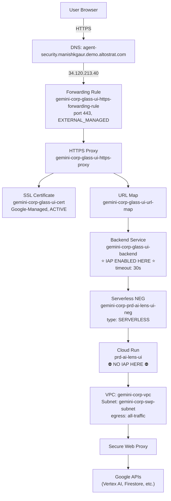

# Cloud Run + IAP: End-to-End Infrastructure & Deploy Guardrails

> [!CAUTION]
> These rules are based on real production outages. Violating ANY of them will cause
> HTTP 500 errors and make the service unreachable. Always read this before deploying.

---

## 1. Architecture — The Full Request Path



### Key Principle

**IAP is enforced ONCE at the Load Balancer backend service level. Cloud Run does NOT have its own IAP.**

---

## 2. Component Inventory (PRD)

### 2a. DNS & Static IP

| Setting | Value |
|---|---|
| Domain | `agent-security.manishkgaur.demo.altostrat.com` |
| Static IP name | `gemini-corp-glass-ui-ip` |
| Static IP address | `34.120.213.40` |
| DNS record | A record → `34.120.213.40` |

### 2b. SSL Certificate

| Setting | Value |
|---|---|
| Name | `gemini-corp-glass-ui-cert` |
| Type | `MANAGED` (Google-managed, auto-renewing) |
| Domain | `agent-security.manishkgaur.demo.altostrat.com` |
| Status | `ACTIVE` |

### 2c. Forwarding Rule (LB Frontend)

| Setting | Value |
|---|---|
| Name | `gemini-corp-glass-ui-https-forwarding-rule` |
| IP | `34.120.213.40` |
| Protocol | `TCP` |
| Port | `443` |
| Scheme | `EXTERNAL_MANAGED` |
| Target | `gemini-corp-glass-ui-https-proxy` |

### 2d. HTTPS Proxy

| Setting | Value |
|---|---|
| Name | `gemini-corp-glass-ui-https-proxy` |
| SSL Cert | `gemini-corp-glass-ui-cert` |
| URL Map | `gemini-corp-glass-ui-url-map` |

### 2e. URL Map

| Setting | Value |
|---|---|
| Name | `gemini-corp-glass-ui-url-map` |
| Default Service | `gemini-corp-glass-ui-backend` |
| Host/Path Rules | None (all traffic → default backend) |

### 2f. Backend Service (⭐ IAP Lives Here)

| Setting | Value |
|---|---|
| Name | `gemini-corp-glass-ui-backend` |
| Protocol | `HTTP` |
| Port | `http` |
| **IAP** | **`enabled: true`** |
| IAP OAuth2 Client | `446959546335-1d9i9grmhsal2k0natvvviigpbiiaja4.apps.googleusercontent.com` |
| Timeout | `30s` (LB-level; Cloud Run timeout is separate at 1800s) |
| Connection Draining | `300s` |
| Backend (NEG) | `gemini-corp-prd-ai-lens-ui-neg` (us-central1) |
| Balancing Mode | `UTILIZATION` |

### 2g. Serverless NEG

| Setting | Value |
|---|---|
| Name | `gemini-corp-prd-ai-lens-ui-neg` |
| Type | `SERVERLESS` |
| Cloud Run Service | `prd-ai-lens-ui` |
| Region | `us-central1` |

### 2h. Cloud Run Service

| Setting | Value |
|---|---|
| Name | `prd-ai-lens-ui` |
| Project | `agentic-security-prd` (`446959546335`) |
| Region | `us-central1` |
| Image | `us-central1-docker.pkg.dev/agentic-security-prd/prism-glass-ui/ai-prism-agent-glass-ui` |
| **IAP on Cloud Run** | **`false` (MUST be false)** |
| Ingress | `all` |
| Default URL | `disabled` (no `*.run.app` URL) |
| Auth | `no-allow-unauthenticated` (IAP SA is the invoker) |
| CPU | `4` |
| Memory | `8Gi` |
| Max instances | `20` |
| Min instances | `1` |
| Timeout | `1800s` |
| Service Account | `446959546335-compute@developer.gserviceaccount.com` |
| Startup CPU Boost | `true` |
| Threat Detection | `true` |

### 2i. VPC & Networking

| Setting | Value |
|---|---|
| VPC | `gemini-corp-vpc` |
| Subnet | `gemini-corp-swp-subnet` |
| **VPC Egress** | **`all-traffic`** (MUST be `all-traffic`) |
| Secure Web Proxy | Routes all outbound traffic including Google APIs |

### 2j. IAM Bindings

| Resource | Member | Role |
|---|---|---|
| Cloud Run `prd-ai-lens-ui` | `serviceAccount:service-446959546335@gcp-sa-iap.iam.gserviceaccount.com` | `roles/run.invoker` |
| Cloud Run Service Account | `446959546335-compute@developer.gserviceaccount.com` | `roles/aiplatform.user` |

> [!IMPORTANT]
> The IAP service agent (`service-{PROJECT_NUMBER}@gcp-sa-iap.iam.gserviceaccount.com`)
> MUST have `roles/run.invoker` on the Cloud Run service. Without it, IAP can authenticate
> the user but cannot invoke the Cloud Run service, resulting in 403 errors.

---

## 3. Mandatory Deploy Rules

### Rule 1: NEVER Use `--iap` on Cloud Run

> [!CAUTION]
> **NEVER** pass `--iap` to `gcloud run deploy` or `gcloud run services update`.
> Always use `--no-iap`.

IAP is already enabled on the **backend service** (`gemini-corp-glass-ui-backend`).
Enabling IAP on Cloud Run creates a **double-IAP conflict** — HTTP 500 with **no logs**
(the request dies before reaching the container).

**Worst part:** `--iap` is a **service-level** flag. Enabling it breaks ALL revisions,
including rollbacks. You must explicitly run `--no-iap` to fix it.

```bash
# CORRECT
gcloud run deploy prd-ai-lens-ui --no-iap ...

# WRONG — CAUSES OUTAGE
gcloud run deploy prd-ai-lens-ui --iap ...

# FIX IF BROKEN
gcloud run services update prd-ai-lens-ui \
  --project=agentic-security-prd --region=us-central1 --no-iap
```

### Rule 2: VPC Egress MUST Be `all-traffic`

> [!CAUTION]
> **ALWAYS** use `--vpc-egress=all-traffic`. Never use `private-ranges-only`.

The Secure Web Proxy handles ALL outbound traffic including HTTPS to `*.googleapis.com`.
With `private-ranges-only`, API calls bypass the SWP and fail silently or with SSL errors.

```bash
# CORRECT
--vpc-egress=all-traffic

# WRONG — BREAKS API CALLS
--vpc-egress=private-ranges-only
```

### Rule 3: Required Environment Variables

> [!IMPORTANT]
> These env vars MUST be present. Missing any will cause runtime failures.

| Variable | Value | Why |
|---|---|---|
| `PYTHONHTTPSVERIFY` | `0` | SWP/corporate proxy SSL cert chain |
| `GCP_PROJECT_ID` | `agentic-security-prd` | All API clients |
| `GCP_LOCATION` | `us-central1` | Vertex AI region |
| `AGENTIC_LENS_SUPERVISOR_ENGINE` | `projects/446959546335/locations/us-central1/reasoningEngines/2666173310601003008` | Supervisor routing |
| `CHAT_ENGINE_ID` | `projects/446959546335/locations/us-central1/reasoningEngines/7036700145173397504` | Chat dept |
| `ENG_ENGINE_ID` | `projects/446959546335/locations/us-central1/reasoningEngines/6856556160078577664` | Eng dept |
| `XRAY_ENGINE_ID` | `projects/446959546335/locations/us-central1/reasoningEngines/7702106990117388288` | X-Ray dept |
| `EVENTS_ENGINE_ID` | `projects/446959546335/locations/us-central1/reasoningEngines/6992790048806535168` | Events dept |
| `AGENT_ENGINE_SUPERVISOR_TIMEOUT_S` | `240` | Supervisor stream timeout |
| `AGENT_ENGINE_DEPARTMENT_TIMEOUT_S` | `840` | Department stream timeout |

When updating env vars, use `--update-env-vars` (additive) not `--set-env-vars` (replaces all).

### Rule 4: Snapshot Before Deploy

```bash
# Capture current config before making changes
gcloud run revisions describe $(gcloud run services describe prd-ai-lens-ui \
  --project=agentic-security-prd --region=us-central1 \
  --format='value(status.latestReadyRevisionName)') \
  --project=agentic-security-prd --region=us-central1 \
  --format='yaml(spec,metadata.annotations)' > /tmp/cloud-run-snapshot.yaml
```

### Rule 5: Load Balancer & NEG Compatibility Rules

> [!CAUTION]
> **ALWAYS** use `EXTERNAL_MANAGED` for the Forwarding Rule and `HTTP` protocol for the Backend Service when routing to Cloud Run.

Classic load balancers (`EXTERNAL` scheme) and HTTPS backend protocols will cause silent SSL handshake failures or "unexpected eof" errors when used with Serverless NEGs.
1. **Forwarding Rule**: Must use `--load-balancing-scheme=EXTERNAL_MANAGED`. This provisions a modern Global Application Load Balancer which handles managed SSL certificates correctly and rapidly.
2. **Backend Service**: Must use `--protocol=HTTP`. Cloud Run automatically handles TLS termination internally. If the Load Balancer proxy attempts to speak HTTPS directly to the Cloud Run container, it will fail health checks and the connection will be dropped.

---

## 4. Reference Deploy Command

This is the **known-good** command. Do not deviate from these flags:

```bash
gcloud run deploy prd-ai-lens-ui \
  --image us-central1-docker.pkg.dev/agentic-security-prd/prism-glass-ui/ai-prism-agent-glass-ui:latest \
  --platform managed \
  --region us-central1 \
  --project agentic-security-prd \
  --no-allow-unauthenticated \
  --ingress=all \
  --no-iap \
  --memory 8Gi \
  --cpu 4 \
  --max-instances 20 \
  --timeout 1800 \
  --network=gemini-corp-vpc \
  --subnet=gemini-corp-swp-subnet \
  --vpc-egress=all-traffic \
  --update-env-vars "PYTHONHTTPSVERIFY=0,GCP_PROJECT_ID=agentic-security-prd,GCP_LOCATION=us-central1"
```

---

## 5. Building the Glass UI Image

The `glass_ui/` frontend directory may not exist in all workspace checkouts.
Use the **patch Dockerfile** to layer backend changes on the existing image:

```dockerfile
# Dockerfile_glass_ui_patch
FROM us-central1-docker.pkg.dev/agentic-security-prd/prism-glass-ui/ai-prism-agent-glass-ui:<current-tag>
COPY backend /app/backend
COPY glass_ui_api.py /app/glass_ui_api.py
```

```bash
gcloud builds submit --project agentic-security-prd --config cloudbuild_glass_ui_patch.yaml .
```

---

## 6. Troubleshooting

| Symptom | Cause | Fix |
|---|---|---|
| HTTP 500, **no** Cloud Run logs | `--iap` enabled on Cloud Run (double-IAP) | `gcloud run services update ... --no-iap` |
| HTTP 500, SSL errors in logs | Missing `PYTHONHTTPSVERIFY=0` | `--update-env-vars "PYTHONHTTPSVERIFY=0"` |
| HTTP 500, API timeout errors | `vpc-egress=private-ranges-only` | Redeploy with `--vpc-egress=all-traffic` |
| HTTP 403 after IAP login | IAP SA missing `run.invoker` role | Add `service-{NUM}@gcp-sa-iap.iam.gserviceaccount.com` as invoker |
| HTTP 504 gateway timeout | LB backend timeout too low (30s) | Increase via `gcloud compute backend-services update ... --timeout=1800` |
| Rollback doesn't fix 500 | IAP is service-level, not revision-level | Must explicitly `--no-iap` |
| Site loads but query hangs | Supervisor engine broken + high retry count | Reduce `_SUPERVISOR_RETRY_ATTEMPTS` in `agent_engine_client.py` |
| Cloud Build fails on `glass_ui/` | Frontend not in workspace | Use `Dockerfile_glass_ui_patch` approach |
| DNS not resolving | A record missing for custom domain | Point domain to static IP `34.120.213.40` |
| SSL cert not ACTIVE | DNS not pointing to LB IP | Verify A record → `34.120.213.40`, wait for provisioning |

---

## 7. Creating This Stack From Scratch

If you ever need to recreate this infrastructure (e.g., for a new environment), here is
the full ordered sequence:

```bash
PROJECT_ID=agentic-security-prd
REGION=us-central1
SERVICE_NAME=prd-ai-lens-ui

# 1. Reserve static IP
gcloud compute addresses create gemini-corp-glass-ui-ip --global --project=$PROJECT_ID

# 2. Create managed SSL cert (requires DNS A record pointed at the IP first)
gcloud compute ssl-certificates create gemini-corp-glass-ui-cert \
  --domains=agent-security.manishkgaur.demo.altostrat.com \
  --global --project=$PROJECT_ID

# 3. Deploy Cloud Run service (NO IAP, all-traffic egress)
gcloud run deploy $SERVICE_NAME \
  --image <IMAGE> --platform managed --region $REGION --project $PROJECT_ID \
  --no-allow-unauthenticated --ingress=all --no-iap \
  --memory 8Gi --cpu 4 --max-instances 20 --timeout 1800 \
  --network=gemini-corp-vpc --subnet=gemini-corp-swp-subnet \
  --vpc-egress=all-traffic

# 4. Create serverless NEG pointing to Cloud Run
gcloud compute network-endpoint-groups create gemini-corp-prd-ai-lens-ui-neg \
  --region=$REGION --network-endpoint-type=SERVERLESS \
  --cloud-run-service=$SERVICE_NAME --project=$PROJECT_ID

# 5. Create backend service with IAP enabled
gcloud compute backend-services create gemini-corp-glass-ui-backend \
  --global --protocol=HTTP --port-name=http \
  --timeout=30 --connection-draining-timeout=300 \
  --iap=enabled,oauth2-client-id=<CLIENT_ID>,oauth2-client-secret=<SECRET> \
  --load-balancing-scheme=EXTERNAL_MANAGED \
  --project=$PROJECT_ID
gcloud compute backend-services add-backend gemini-corp-glass-ui-backend \
  --global --network-endpoint-group=gemini-corp-prd-ai-lens-ui-neg \
  --network-endpoint-group-region=$REGION --project=$PROJECT_ID

# 6. Create URL map
gcloud compute url-maps create gemini-corp-glass-ui-url-map \
  --default-service=gemini-corp-glass-ui-backend --global --project=$PROJECT_ID

# 7. Create HTTPS proxy
gcloud compute target-https-proxies create gemini-corp-glass-ui-https-proxy \
  --ssl-certificates=gemini-corp-glass-ui-cert \
  --url-map=gemini-corp-glass-ui-url-map --global --project=$PROJECT_ID

# 8. Create forwarding rule
gcloud compute forwarding-rules create gemini-corp-glass-ui-https-forwarding-rule \
  --global --target-https-proxy=gemini-corp-glass-ui-https-proxy \
  --address=gemini-corp-glass-ui-ip --ports=443 \
  --load-balancing-scheme=EXTERNAL_MANAGED --project=$PROJECT_ID

# 9. Grant IAP SA the invoker role on Cloud Run
PROJECT_NUMBER=$(gcloud projects describe $PROJECT_ID --format='value(projectNumber)')
gcloud run services add-iam-policy-binding $SERVICE_NAME \
  --region=$REGION --project=$PROJECT_ID \
  --member="serviceAccount:service-${PROJECT_NUMBER}@gcp-sa-iap.iam.gserviceaccount.com" \
  --role="roles/run.invoker"

# 10. gcloud iap web add-iam-policy-binding (grant specific users access)
gcloud iap web add-iam-policy-binding \
  --resource-type=backend-services \
  --service=gemini-corp-glass-ui-backend \
  --project=$PROJECT_ID \
  --member="user:your-email@example.com" \
  --role="roles/iap.httpsResourceAccessor"
```

---

## 8. agentic-ppub Project (Technical Paper Publication)

> [!IMPORTANT]
> This is a SEPARATE project from `agentic-security-prd`. Different resource names, same patterns.

### Infrastructure Map

| Component | Value |
|---|---|
| **Project ID** | `agentic-ppub` |
| **Project Number** | `301005218072` |
| **Live URL** | `https://ppub.manishkgaur.demo.altostrat.com` |
| **LB Static IP** | `8.232.94.81` |
| **SSL Cert** | `agentic-ppub-cert` (ACTIVE) |
| **SSL Domain** | `ppub.manishkgaur.demo.altostrat.com` |
| **Forwarding Rule** | `agentic-ppub-https-fwd` |
| **HTTPS Proxy** | `agentic-ppub-https-proxy` |
| **Backend Service** | `agentic-ppub-backend-svc` (IAP enabled) |
| **Serverless NEG** | `agentic-ppub-neg` → `agentic-ppub-frontend` Cloud Run |
| **Frontend Cloud Run** | `agentic-ppub-frontend` |
| **Backend Cloud Run** | `agentic-ppub-backend` |
| **Frontend Image** | `us-central1-docker.pkg.dev/agentic-ppub/agentic-ppub-repo/frontend:latest` |
| **Backend Image** | `us-central1-docker.pkg.dev/agentic-ppub/agentic-ppub-repo/backend:latest` |
| **IAP SA** | `service-301005218072@gcp-sa-iap.iam.gserviceaccount.com` |

### Known-Good Deploy Commands

**Backend (after code change):**
```bash
gcloud builds submit \
  --project=agentic-ppub \
  --tag us-central1-docker.pkg.dev/agentic-ppub/agentic-ppub-repo/backend:latest \
  --timeout=1200 \
  backend/

gcloud run deploy agentic-ppub-backend \
  --image us-central1-docker.pkg.dev/agentic-ppub/agentic-ppub-repo/backend:latest \
  --platform managed \
  --region us-central1 \
  --project agentic-ppub \
  --no-allow-unauthenticated \
  --memory 4Gi \
  --cpu 2 \
  --timeout 1800 \
  --max-instances 10 \
  --set-env-vars "GCP_PROJECT_ID=agentic-ppub,GOOGLE_CLOUD_PROJECT=agentic-ppub,USE_ADK_AGENTS=true,GCS_BUCKET_NAME=agentic-ppub-final-docs"
```

**Frontend (after code change):**
```bash
gcloud builds submit \
  --project=agentic-ppub \
  --tag us-central1-docker.pkg.dev/agentic-ppub/agentic-ppub-repo/frontend:latest \
  --timeout=1200 \
  frontend/

gcloud run deploy agentic-ppub-frontend \
  --image us-central1-docker.pkg.dev/agentic-ppub/agentic-ppub-repo/frontend:latest \
  --platform managed \
  --region us-central1 \
  --project agentic-ppub \
  --no-allow-unauthenticated \
  --memory 2Gi \
  --cpu 1 \
  --timeout 300 \
  --max-instances 5 \
  --set-env-vars "NEXT_PUBLIC_PROJECT_ID=agentic-ppub,GCP_PROJECT_ID=agentic-ppub,NEXT_PUBLIC_BACKEND_URL=https://agentic-ppub-backend-bxc7vyiuaq-uc.a.run.app"
```

**Env-var-only update (no rebuild):**
```bash
gcloud run services update agentic-ppub-frontend \
  --region us-central1 --project agentic-ppub \
  --update-env-vars "KEY=VALUE"
```

**Grant user access via IAP:**
```bash
gcloud iap web add-iam-policy-binding \
  --resource-type=backend-services \
  --service=agentic-ppub-backend-svc \
  --project=agentic-ppub \
  --member="user:someone@domain.com" \
  --role="roles/iap.httpsResourceAccessor"
```

### Rules for agentic-ppub
- NEVER use `--iap` on Cloud Run services — IAP is on `agentic-ppub-backend-svc` LB backend only
- Always use `--no-allow-unauthenticated` on both Cloud Run services
- Use `--set-env-vars` (not `--update-env-vars`) for backend deploys — full env list must be specified
- Use `--update-env-vars` for env-only updates with no image change
